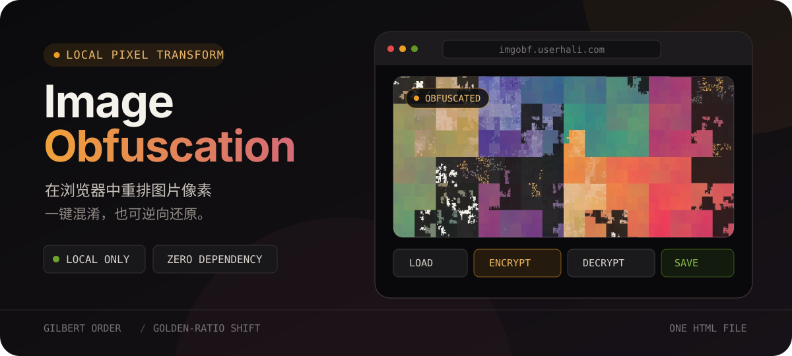
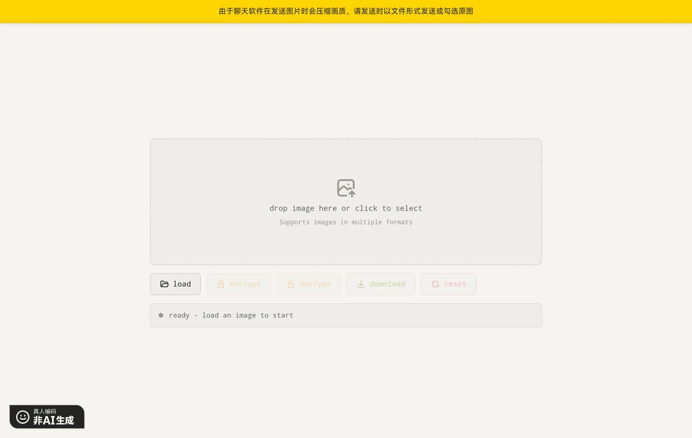
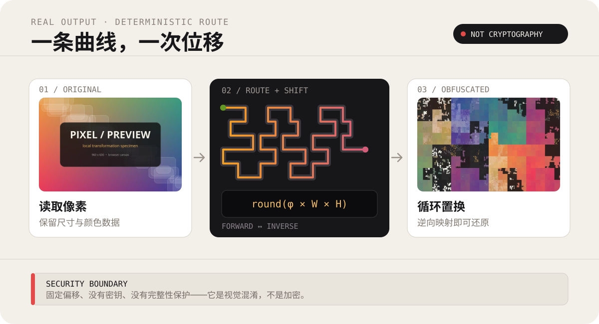

<p align="center">
  
</p>

<p align="center">
  <a href="https://imgobf.userhali.com"><strong>在线使用</strong></a>
  ·
  <a href="#工作原理">工作原理</a>
  ·
  <a href="https://github.com/haliChina/Image-Obfuscation/issues">问题反馈</a>
</p>

<p align="center">
  
  
  
</p>

## 先看效果

Image Obfuscation 是一个**单文件、纯浏览器运行**的图片像素置换工具。载入图片后即可混淆、还原并下载结果；核心处理发生在浏览器内，无需安装依赖或构建项目。

<p align="center">
  
</p>

> [!IMPORTANT]
> 混淆图片通过聊天软件发送时，请选择“原图”或以文件形式发送。平台压缩会改变像素，可能导致无法正确还原。

## 快速开始

### 在线使用

打开 **[imgobf.userhali.com](https://imgobf.userhali.com)**，然后：

1. 拖入或选择一张图片。
2. 点击 `encrypt` 混淆，或点击 `decrypt` 还原。
3. 点击 `download` 保存处理结果。

### 本地使用

```bash
git clone https://github.com/haliChina/Image-Obfuscation.git
cd Image-Obfuscation
```

直接用浏览器打开 `index.html` 即可。项目没有依赖，也不需要构建步骤。

## 工作原理

<p align="center">
  
</p>

1. **Gilbert 曲线排序**

   使用广义 Hilbert 空间填充曲线访问每个像素。Gilbert 版本适用于任意宽高的矩形，不要求边长为 2 的幂。

2. **黄金比例偏移**

   根据像素总数计算固定偏移：

   ```text
   offset = round(((√5 − 1) / 2) × width × height)
   ```

3. **循环置换**

   混淆时，将曲线序列中第 `i` 个像素移到 `(i + offset) % n`；还原时执行逆向映射。

## 特性

- 在浏览器内完成图片处理
- 支持拖放和多种浏览器可读取的图片格式
- 混淆与还原使用互逆操作
- 单个 `index.html`，零依赖、零构建
- 处理完成后导出 JPEG（质量参数 `0.95`）
- 支持跟随系统深色/浅色主题

## 安全边界

> [!WARNING]
> 这是**可逆像素置换/视觉混淆工具，不是密码学加密工具**。

当前算法使用公开、确定性的固定偏移，没有密码、随机密钥、认证或完整性保护。它适合降低图片内容被直接浏览的便利性，但不应被用于保护敏感信息，也不能替代经过审计的加密方案。

JPEG 属于有损格式。重复处理、二次压缩、裁剪、缩放或平台转码都可能破坏像素映射，使结果无法完整还原。

## 项目结构

```text
Image-Obfuscation/
├── index.html   # 界面、样式与全部变换逻辑
├── README.md
└── LICENSE
```

## 反馈

- [提交 Issue](https://github.com/haliChina/Image-Obfuscation/issues)
- 邮箱：`admin@userhali.com`

## License

本项目采用 [Apache License 2.0](./LICENSE)。
